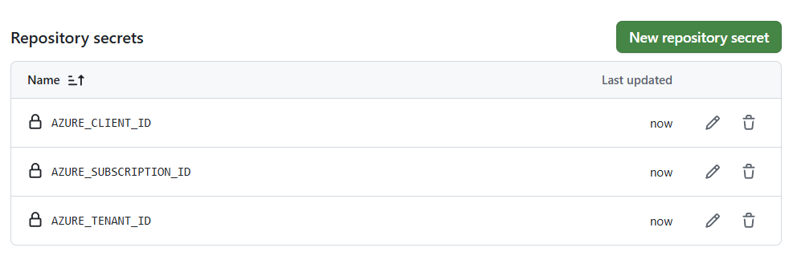

# Deploy bicep templates using GitHub Actions

When you want to deploy Bicep templates using GitHub Actions, you can use `az login` Azure CLI command or the `azure/login` GitHub Action to authenticate to Azure. A more secure and recommended way is to use workload identities with OpenID Connect (OIDC) to authenticate without needing to store long-lived credentials in GitHub Secrets. 

**So what are federated identity credentials?**

Federated identity credentials are a modern approach to managing application authentication in Microsoft Entra ID. They enable workload identity federation, allowing software workloads to access Microsoft Entra-protected resources without the need to manage secrets like certificates or client secrets. This method leverages industry-standard protocols such as OAuth 2.0 and OpenID Connect to establish trust between the identity provider (IdP) and Microsoft Entra ID. By using federated identity credentials, applications can authenticate securely and seamlessly, reducing the risk associated with secret management.

#### OpenID Connect
To use Azure Login action with OIDC, you need to configure a federated identity credential on a Microsoft Entra application or a user-assigned managed identity.

- Using a Microsoft Entra application
- Using a User-assigned managed identity

In this blog post, we will use a User-assigned managed identity, but the steps are similar for both options. 

Let's go through the steps to set this up.
- Create a user-assigned managed identity.
- Copy the values for Client ID, Subscription ID, and Directory (tenant) ID to use later in your GitHub Actions workflow.
- In your GitHub repository, go to Settings > Secrets and variables > Actions, and add the following secrets:
  - AZURE_CLIENT_ID: The Client ID of the user-assigned managed identity.
  - AZURE_SUBSCRIPTION_ID: The Subscription ID where the managed identity is created.
  - AZURE_TENANT_ID: The Directory (tenant) ID of your Entra tenant.
-  See picture below:

- Assign an appropriate role to your user-assigned managed identity. For deploying Bicep files, you typically need the "Contributor" role at the subscription or resource group level, depending on your deployment scope.
- Configure a federated identity credential on a user-assigned managed identity to trust tokens issued by GitHub Actions to your GitHub repository.
- 

#### Create a federated identity credential using Azure PowerShell
```powershell
$ResourceGroupName = "<your-resource-group-name>"
$IdentityName = "<your-user-assigned-managed-identity-name>"
New-AzFederatedIdentityCredentials `
-ResourceGroupName $ResourceGroupName `
-IdentityName $IdentityName `
-Name "AppName" `
-Issuer "https://token.actions.githubusercontent.com" `
-Subject "repo:$GitHubOrganizationName/$GitHubRepo:ref:refs/heads/main" `
-Audience "api://AzureADTokenExchange"
```

Verify the federated identity credential was created successfully:
```powershell
Get-AzFederatedIdentityCredential -ResourceGroupName $ResourceGroupName -IdentityName $IdentityName -Name "AppName"
```

#### Create a federated identity credential using Azure CLI
```bash
$ResourceGroupName="<your-resource-group-name>"
$IdentityName="<your-user-assigned-managed-identity-name>"
az identity federated-credential create --resource-group $ResourceGroupName --identity-name $IdentityName \
--name "AppName" \
--issuer "https://token.actions.githubusercontent.com" \
--audiences "api://AzureADTokenExchange" \
--subject "repo:${GitHubOrganizationName}/${GitHubRepo}:ref:refs/heads/main"
```

#### Create a federated identity credential using a Bicep template
You can also create the user-assigned managed identity and the federated identity credential using a Bicep template. Below is an Bicep template that creates both resources:

```bicep
@description('Location for identities resources. FIC should be enabled in this region.')
param location string = 'swedencentral'

@description('Name of the User Assigned identity (parent identity)')
param userAssignedIdentityName string = 'FIC_UA'

@description('Name of the Federated Identity Credential')
param federatedIdentityCredential string = 'testCredential'

@description('Federated Identity Credential token issuer')
param federatedIdentityCredentialIssuer string = 'https://token.actions.githubusercontent.com'

@description('Federated Identity Credential token subject')
param federatedIdentityCredentialSubject string = 'repo:your-github-organization/your-github-repo:ref:refs/heads/main'

@description('Federated Identity Credential audience. Single value is only supported.')
param federatedIdentityCredentialAudience string = ' api://AzureADTokenExchange'

resource userAssignedIdentity 'Microsoft.ManagedIdentity/userAssignedIdentities@2025-01-31-preview' = {
  name: userAssignedIdentityName
  location: location
  tags: {
    firstTag: 'ficTest'
  }
}

resource userAssignedIdentityName_federatedIdentityCredential 'Microsoft.ManagedIdentity/userAssignedIdentities/federatedIdentityCredentials@2025-01-31-preview' = {
  parent: userAssignedIdentity
  name: federatedIdentityCredential
  properties: {
    issuer: federatedIdentityCredentialIssuer
    subject: federatedIdentityCredentialSubject
    audiences: [
      federatedIdentityCredentialAudience
    ]
  }
}
```

#### GitHub Actions workflow example for deploying bicep templates with workload identity

Now that we have set up the user-assigned managed identity and federated identity credential, we will create a GitHub Actions workflow to deploy Bicep templates using the `azure/login` action with the workload identity.
The workflow below first checks out the repository, logs in to Azure using the workload identity, and then deploys the Bicep template using the `azure/arm-deploy` action.

```yaml
name: Deploy Infrastructure
on:
  push:
    branches:
      - main
jobs:

  lint:
    runs-on: ubuntu-latest
    steps:
      - name: Checkout repository
        uses: actions/checkout@v4
      - name: Lint Bicep files
        run:  az bicep build ./infra/main.bicep

  deploy:
      runs-on: ubuntu-latest
      permissions:
         id-token: write
         contents: read
      steps:
         - name: Checkout repository
           uses: actions/checkout@v4
   
         - name: Login to Azure using Workload Identity
           uses: azure/login@v1
           with:
             client-id: ${{ secrets.AZURE_CLIENT_ID }}
             tenant-id: ${{ secrets.AZURE_TENANT_ID }}
             subscription-id: ${{ secrets.AZURE_SUBSCRIPTION_ID }}
   
         - name: Deploy Bicep template
           uses: azure/arm-deploy@v1
           with:
              scope: 'subscription'
              location: 'Sweden Central'
              template: './infra/main.bicep'
              parameters: |
                 param1=value1
                 param2=value2
              deployment-name: 'infrastructure-deployment'
```

#### References
https://learn.microsoft.com/en-us/azure/azure-resource-manager/bicep/deploy-github-actions?tabs=CLI%2Copenid
